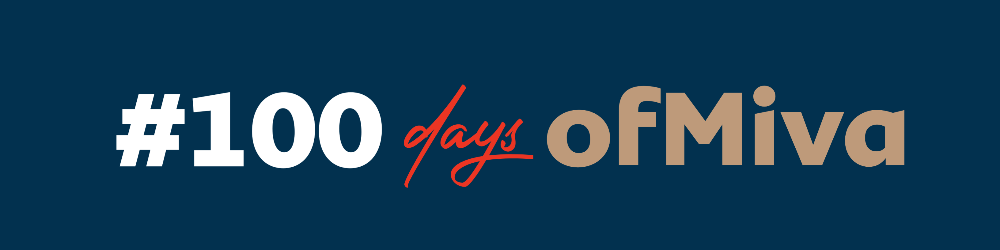

# 100 Days of Miva - API and Front-end Projects



Welcome to my repository for the #100daysofMiva challenge! This repository contains a collection of 100 simple API projects developed over 100 days. The challenge is all about consistency, learning, and building resilience through daily coding.

## About the Challenge

The #100daysofMiva challenge is designed to help developers, especially students of Miva Open University, develop a strong work ethic by committing to coding every day. The goal is to spend at least one hour each day working on a small project, pushing the boundaries of our skills, and documenting our progress.

## Repository Structure

This repository is organized into three main sections, each corresponding to a different programming language:
```
/100daysofMiva
├── README.md
├── public/
│   ├── banner.jpg
│   └── (other assets)
└── Projects/
    ├── Day 1 | hello world API/
    │   ├── php/
    │   ├── nodejs/
    │   ├── python/
    │   └── README.md...
```

- **PHP**: Projects built using PHP, ranging from basic APIs to more complex web services.
- **Python**: A variety of APIs created with Python, exploring different libraries and frameworks.
- **Node.js**: Projects developed using Node.js, focusing on building scalable and efficient APIs.

## How to Use This Repository

1. **Clone the Repository**:
    ```bash
    git clone https://github.com/Marvellye/100daysofMiva.git
    ```

2. **Navigate to a Project**:
    ```bash
    cd PHP/Project1
    ```

3. **Run the Project**:
    - Follow the instructions in the `README.md` file within each project directory to set up and run the API locally.

## Daily Progress

Each day, a new project will be added to this repository. Every project is documented with instructions on how to set it up, the key learning points, and any challenges encountered during development.

## Get Involved

You can join the #100daysofMiva challenge by:
- Forking this repository and working on your versions of the projects.
- Contributing to the projects by submitting pull requests.
- Sharing your progress on social media with the hashtag #100daysofMiva.

## License

This repository is licensed under the General public License. See the [LICENSE](LICENSE) file for more details.

## Connect with Me

Follow my journey on:
- [DevTo](https://dev.to/marvellye)
- [Portfolio](https://marvelly.com.ng)
- [Twitter](https://twitter.com/marvelly_ng)
- [LinkedIn](https://www.linkedin.com/in/ezekiel-marvellous-oghenemaga)

Let’s code, learn, and grow together over the next 100 days!

---

**Note:** I would love to learn front-end designs but i have a bad sense of colour and font picking. bear with me 😂😭✌🏻

### Roadmaps
1. Hello world API 
2. Simple web form Create and Read
